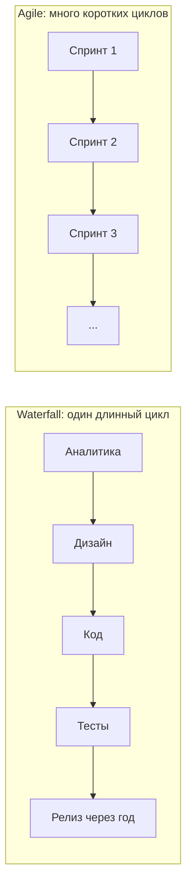
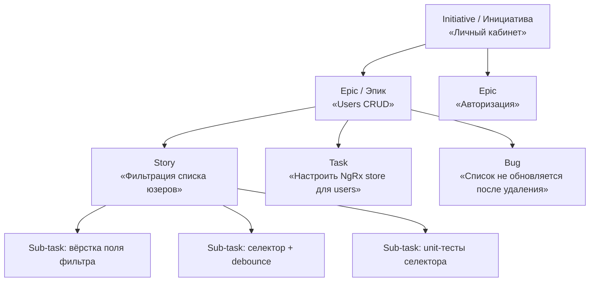
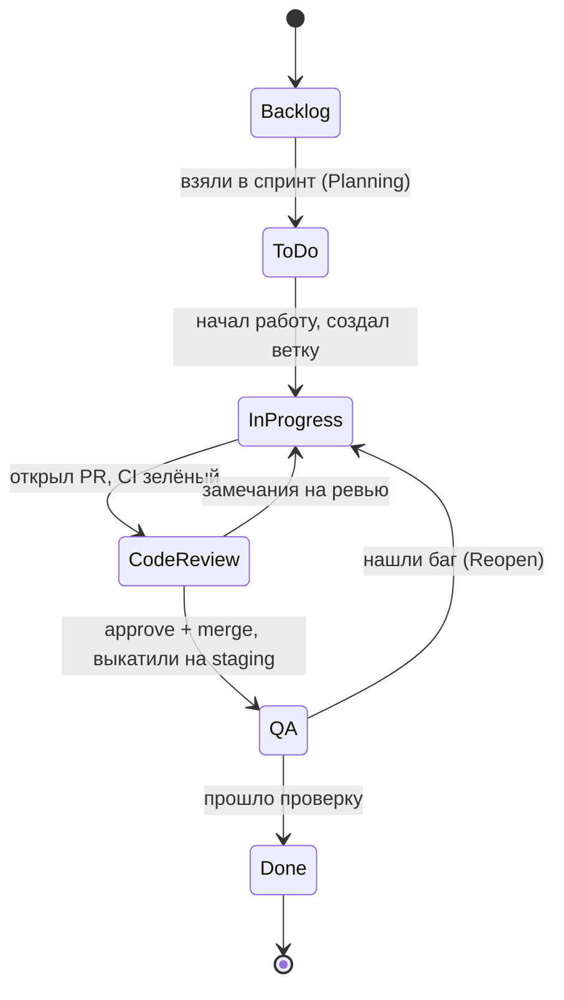
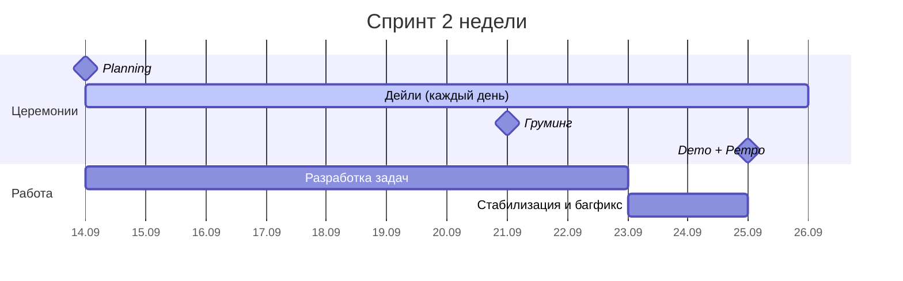
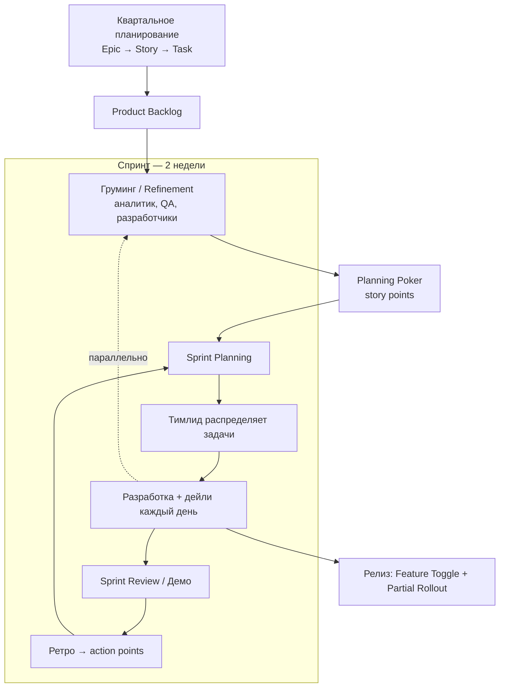
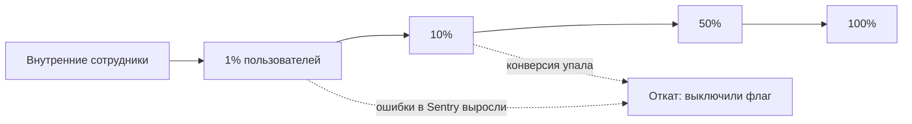

# 03. Как устроена работа в команде: Agile, Scrum, Kanban, Jira

> Этап 0.4 плана. Результат: ты понимаешь **весь путь задачи** — от «бизнесу что-то захотелось» до «фича работает в проде», знаешь, кто на этом пути кто, и умеешь говорить об этом на собеседовании.
> Аккаунт в Jira создаёшь **ты**, доску настраиваешь **ты** (я даю пошаговое ТЗ и проверяю).

Это самый «нетехнический» конспект из всех, и при этом именно его чаще всего проваливают на собесе. Вопрос «расскажи, как у вас был устроен процесс» — проверка на то, работал ли человек в команде вообще.

---

## 1. Зачем процесс. Waterfall против Agile

**Waterfall (водопад)** — классика: аналитика → дизайн → разработка → тестирование → релиз. Каждая стадия начинается, когда полностью закончилась предыдущая. Релиз один, в конце, через год.

Проблема: требования за год устаревают, а ошибку в аналитике видно только на тестировании — переделывать дорого.

**Agile (гибкая разработка)** — не методология, а **набор ценностей**. Идея: резать работу на маленькие куски и показывать результат каждые 1–4 недели, чтобы ошибиться дёшево и рано.



**Agile Manifesto (2001), 4 ценности** — их спрашивают дословно:

| Ценнее                      | чем                              |
| --------------------------- | -------------------------------- |
| Люди и взаимодействие       | процессы и инструменты           |
| Работающий продукт          | исчерпывающая документация       |
| Сотрудничество с заказчиком | согласование условий контракта   |
| Готовность к изменениям     | следование первоначальному плану |

> [!IMPORTANT]
> Ключевая формулировка манифеста: «не отрицая важности того, что справа, мы всё-таки больше ценим то, что слева». Agile не означает «документации нет» и «плана нет». На собесе это отличает человека, который читал манифест, от того, кто пересказывает мемы.

**Иерархия понятий**, которую путают почти все:

```
Agile — философия/ценности (что важно)
  ├── Scrum  — фреймворк (роли + события + артефакты, жёсткие правила)
  ├── Kanban — метод (визуализация потока + ограничение WIP, правил почти нет)
  ├── XP     — инженерные практики (TDD, парное программирование, CI)
  └── SAFe / LeSS — масштабирование Agile на много команд (крупные банки, корпорации)
```

Scrum — это **не** Agile целиком, а один из способов его применить.

---

## 2. Scrum: роли, события, артефакты

Scrum держится на трёх вещах: **3 роли, 5 событий, 3 артефакта**. Это скелет ответа на собесе.

### 2.1 Роли (в Scrum Guide — «accountabilities»)

| Роль                     | За что отвечает                                                                      | Как выглядит в жизни                                               |
| ------------------------ | ------------------------------------------------------------------------------------ | ------------------------------------------------------------------ |
| **Product Owner (PO)**   | **Что** делать и в каком порядке: владелец бэклога, приоритеты, ценность для бизнеса | Часто он же продакт-менеджер; приносит требования от бизнеса       |
| **Scrum Master (SM)**    | **Как** идёт процесс: снимает блокеры, ведёт церемонии, защищает команду от хаоса    | Нередко эту роль совмещает тимлид или PM                           |
| **Developers (команда)** | **Как** делать технически, оценка и качество                                         | 5–9 человек: фронты, бэки, QA — все внутри одной команды. Ты здесь |

> [!NOTE]
> В Scrum Guide нет ролей «тимлид», «техлид», «тестировщик», «аналитик» — формально все они входят в Developers. В реальных компаниях эти роли есть и они важны. На собесе так и говори: «по Scrum Guide ролей три, у нас фактически были ещё тимлид, аналитик и два QA внутри команды разработки».

### 2.2 События (церемонии)

| Событие                          | Когда                            | Длительность (спринт 2 нед.) | Смысл                                                                                 |
| -------------------------------- | -------------------------------- | ---------------------------- | ------------------------------------------------------------------------------------- |
| **Sprint (спринт)**              | Постоянно                        | 1–4 недели, у нас 2          | Контейнер для всех остальных событий; длина не меняется                               |
| **Sprint Planning**              | Первый день спринта              | до 4 ч                       | Берём задачи из бэклога в спринт, декомпозируем, оцениваем                            |
| **Daily Scrum (дейли)**          | Каждый день в одно и то же время | 15 мин                       | Синхронизация команды: что сделал, что буду, что мешает                               |
| **Sprint Review (демо)**         | Последний день спринта           | до 2 ч                       | Показываем **работающий** инкремент заказчику, собираем обратную связь                |
| **Sprint Retrospective (ретро)** | После демо                       | до 1,5 ч                     | Про процесс, а не про продукт: что хорошо, что плохо, что меняем                      |
| _Backlog Refinement (груминг)_   | В середине спринта               | 1–2 ч                        | Формально не событие Scrum, но есть почти везде: чистим и оцениваем бэклог на будущее |

**Дейли — три вопроса** (классика, часто спрашивают):

1. Что я сделал со вчера?
2. Что буду делать сегодня?
3. Что меня блокирует?

> [!WARNING]
> Частая ошибка на собесе: «дейли — это отчёт перед менеджером». Нет. Дейли — синхронизация **команды между собой**, менеджер там может вообще не присутствовать. И дейли не для решения проблем: всплыл блокер — обсуждаете его отдельно после дейли с теми, кого он касается («парковка»).

### 2.3 Артефакты

| Артефакт            | Что это                                                          | Обязательство (commitment)   |
| ------------------- | ---------------------------------------------------------------- | ---------------------------- |
| **Product Backlog** | Единый упорядоченный список всего, что хотят от продукта         | Product Goal — цель продукта |
| **Sprint Backlog**  | Задачи, взятые в текущий спринт, + план как их сделать           | Sprint Goal — цель спринта   |
| **Increment**       | Работающий результат спринта, соответствующий Definition of Done | Definition of Done           |

---

## 3. Оценка задач: story points, Planning Poker, velocity

Оценивают не в часах, а в **story points (SP)** — условных единицах сложности. Причина: человек плохо угадывает абсолютное время, но неплохо сравнивает задачи между собой («вот эта примерно вдвое сложнее той»).

Шкала — ряд Фибоначчи: `1, 2, 3, 5, 8, 13, 21`. Чем больше число, тем выше неопределённость, поэтому шаги растут.

**Planning Poker.** Все одновременно показывают свою оценку. Разошлись (3 и 13) — самый низкий и самый высокий объясняют почему, потом переголосовали. Смысл не в цифре, а во **вскрытии разного понимания задачи**.

**Velocity (скорость)** — сколько SP команда реально закрывает за спринт. Считается по факту за 3–5 спринтов и используется, чтобы понимать, сколько брать в следующий.

> [!WARNING]
> Velocity — инструмент планирования команды, **не** метрика продуктивности человека. Как только за неё начинают ругать — команда начинает завышать оценки, и метрика умирает. Хороший ответ на собесе.

**Burndown chart** — график сгорания: сколько SP осталось по дням спринта. Линия идёт выше идеальной — не успеваем, надо резать объём или звать на помощь.

**Capacity** — сколько человеко-дней реально есть в спринте: минус отпуска, минус болезни, минус митинги. Обычно считают, что разработчик пишет код ~60–70 % времени.

Если задача оценена в **13 SP и больше** — её нужно **декомпозировать**: слишком большая, чтобы предсказуемо влезть в спринт.

---

## 4. Kanban и когда он вместо Scrum

Kanban проще: нет спринтов, нет обязательных ролей и церемоний. Есть доска и два правила.

1. **Визуализируй поток.** Все задачи на доске по колонкам-стадиям: `Backlog → Analysis → Dev → Code Review → QA → Done`.
2. **Ограничивай WIP (Work In Progress).** У колонки стоит лимит, например `Dev (3)`. Нельзя взять четвёртую задачу, пока не уехала одна из трёх.

Смысл лимита WIP: пока ты держишь пять «почти готовых» задач, бизнес не получил ни одной. Меньше одновременной работы → быстрее сквозной поток.

**Метрики Kanban** (вместо velocity):

- **Lead time** — от создания задачи до «Done» (что чувствует заказчик).
- **Cycle time** — от взятия в работу до «Done» (что контролирует команда).
- **Throughput** — сколько задач в неделю проходит через доску.

| Критерий             | Scrum                             | Kanban                               |
| -------------------- | --------------------------------- | ------------------------------------ |
| Итерации             | Спринты фиксированной длины       | Непрерывный поток                    |
| Планирование         | На спринт вперёд                  | По мере освобождения слота           |
| Изменения в середине | Нежелательны (спринт «заморожен») | В любой момент                       |
| Роли                 | PO, SM, Developers                | Не обязательны                       |
| Метрики              | Velocity, burndown                | Lead time, cycle time, WIP           |
| Когда лучше          | Продуктовая разработка фич        | Поддержка, техподдержка, поток багов |

**Scrumban** — гибрид: спринты и планирование от Scrum + WIP-лимиты и вытягивание от Kanban. В жизни встречается чаще, чем «чистый» Scrum.

> [!TIP]
> Ответ на собесе, который звучит сильнее шаблонного: «У нас был Scrum со спринтом в 2 недели, но с элементами Kanban: на поддержку и баги с прода был отдельный swimlane без учёта в спринте и с лимитом WIP».

---

## 5. Definition of Ready, Definition of Done, критерии приёмки

Три вещи, которые превращают «сделал вроде» в «сделал».

**User Story (пользовательская история)** — формат описания задачи от лица пользователя:

```
Как <роль>, я хочу <действие>, чтобы <польза>.

Как администратор, я хочу фильтровать список пользователей по имени,
чтобы быстро находить нужного, не листая все страницы.
```

**Acceptance Criteria (критерии приёмки)** — условия, при которых задача считается выполненной. Часто в формате Gherkin (его же используют в автотестах):

```gherkin
Given я на странице /users и в списке есть пользователь "Иван"
When я ввожу "Ив" в поле фильтра
Then в списке остаются только пользователи, чьё имя содержит "Ив"
And фильтр применяется не чаще одного раза в 300 мс
```

**Definition of Ready (DoR)** — когда задачу можно **брать** в спринт: описание есть, критерии приёмки есть, макет приложен, API согласован, задача оценена, зависимости понятны. Без DoR в спринт попадает «сделать красиво» и ломает планирование.

**Definition of Done (DoD)** — когда задачу можно **закрыть**. Общий для всей команды. Пример для фронтенд-команды:

- [ ] Код написан и соответствует код-стайлу (ESLint, Prettier)
- [ ] Все критерии приёмки выполнены
- [ ] Написаны unit-тесты, покрытие не упало
- [ ] CI зелёный (lint, tests, build)
- [ ] PR прошёл ревью и получил минимум один approve
- [ ] Влито в `main`, выкачено на staging
- [ ] Проверено QA на staging
- [ ] Документация обновлена, если менялось поведение

> [!NOTE]
> Вопрос «чем DoD отличается от критериев приёмки» — любимый на собесе. Ответ: **критерии приёмки свои у каждой задачи** (что именно должно работать), **DoD один на всю команду** (какого качества должна быть любая задача).

---

## 6. Jira: структура, статусы, доска

Jira — это база задач с настраиваемым workflow. Главное — понимать иерархию и жизненный цикл задачи.

### 6.1 Иерархия



| Тип          | Когда используется                                              |
| ------------ | --------------------------------------------------------------- |
| **Epic**     | Большой кусок функциональности на несколько спринтов            |
| **Story**    | Ценность для пользователя, влезает в спринт                     |
| **Task**     | Техническая работа без прямой пользы для юзера (настроить CI)   |
| **Bug**      | Дефект                                                          |
| **Sub-task** | Кусок story/task на 0.5–1 день                                  |
| **Spike**    | Исследование с таймбоксом («2 дня разобраться, тянуть ли NgRx») |

### 6.2 Поля задачи, которые реально используют

`Summary` (заголовок), `Description`, `Assignee` (исполнитель), `Reporter` (кто создал), `Priority` (Highest…Lowest), `Story Points`, `Sprint`, `Epic Link`, `Labels`, `Components` (frontend/backend), `Fix Version` (в каком релизе поедет), `Due date`, `Linked issues` (`blocks` / `is blocked by` / `relates to` / `duplicates`).

### 6.3 Workflow — жизненный цикл задачи

Это то, что рисуют на собесе, когда просят «расскажи путь задачи»:



> [!IMPORTANT]
> Статус в Jira должен отражать реальность **в момент времени**, а не в конце дня. Тимлид смотрит на доску и видит: две задачи висят в Code Review третий день → идёт и разгребает ревью. Если двигать статусы задним числом, доска врёт и её перестают читать.

### 6.4 Доска, бэклог, спринт

- **Backlog** — общий список + панель будущих спринтов; здесь мышкой перетаскиваешь задачи в спринт.
- **Board** — доска текущего спринта по колонкам-статусам; здесь живёшь ежедневно.
- **Sprint** — стартуешь (Start sprint: цель, даты), в конце завершаешь (Complete sprint: незакрытое переезжает в следующий спринт или в бэклог).
- **Reports** — Burndown, Velocity, Sprint Report, Cumulative Flow (для Kanban).

### 6.5 JQL — язык запросов

Jira Query Language выглядит как SQL и экономит кучу времени:

```jql
project = SIM AND assignee = currentUser() AND sprint in openSprints() AND status != Done ORDER BY priority DESC
```

```jql
project = SIM AND status = "Code Review" AND updated <= -2d
```

Второй запрос — «что залипло на ревью больше двух дней». Такие фильтры сохраняют и вешают на дашборд.

### 6.6 Связка Jira ↔ Git

В нормальной команде **номер задачи — сквозной идентификатор** через всё:

```
ключ задачи:  SIM-42
ветка:        feature/SIM-42-users-filter
коммит:       feat(users): add name filter (SIM-42)
PR:           SIM-42 Users filter
```

Так по любому коммиту в `git blame` за пять секунд находится задача, в ней — обсуждение и требования, а в PR — ревью. Это и есть ответ на вопрос «почему тут так сделано» через полгода.

Smart commits в Jira умеют двигать статус прямо из сообщения коммита (`SIM-42 #time 2h #comment сделал фильтр`), но полагаться на это не стоит — легко засорить историю.

> [!NOTE]
> У нас в симуляторе задачи будут `SIM-*`, а ветки я в плане называл `feature/HW-XX`. Приведём к одному виду: `feature/SIM-12-http-users`. Это ровно та мелочь, которая на собесе показывает, что человек реально работал по процессу.

---

## 7. Как выглядит обычная неделя фронтендера

Чтобы «движ» стал ощутимым — вот реальный ритм двухнедельного спринта.



**День разработчика:**

| Время | Что                                                                           |
| ----- | ----------------------------------------------------------------------------- |
| 10:00 | Открыл доску: свои задачи в `In Progress`, чужие PR в `Code Review`           |
| 10:15 | Дейли, 15 минут                                                               |
| 10:30 | **Сначала ревьюишь чужие PR**, потом свой код — чтобы коллеги не стояли       |
| 11:00 | Своя задача: ветка от `main`, код, тесты, локально `npm run lint`, `npm test` |
| 15:00 | Открыл PR, CI прогнался, кинул ссылку в чат команды                           |
| 16:00 | Пришли замечания → поправил → `git push` в ту же ветку → PR обновился         |
| 17:30 | Approve → merge → задача в `QA`, автодеплой на staging                        |
| 18:00 | Обновил статусы в Jira, посмотрел, что берёшь завтра                          |

**Что делать, когда не успеваешь** (очень частый вопрос на собесе): не молчать до конца спринта. Сказать на ближайшем дейли: «задача SIM-42 больше, чем мы оценили, вот почему; предлагаю разбить и вынести вторую часть в следующий спринт». Проблема, озвученная в середине спринта, — рабочий момент; та же проблема в день демо — провал.

---

### 7.1 Реальный пример: процесс, который описал ментор

Вот как это выглядит в живой компании (описание от ментора), с разметкой по терминам конспекта:

| #   | Как в компании                                                                                    | Термин                                   | Откуда                                                      |
| --- | ------------------------------------------------------------------------------------------------- | ---------------------------------------- | ----------------------------------------------------------- |
| 1   | На квартальном планировании создаём Epic, декомпозируем на User Story, те — на задачи             | Quarterly / PI Planning, декомпозиция    | **не Scrum** — масштабирование (SAFe) / продуктовый роадмап |
| 2   | Задачи падают в Backlog                                                                           | Product Backlog                          | Scrum                                                       |
| 3   | Груминг: менеджер уточняет у аналитика, QA разбирают тест-кейсы, разрабы проверяют входные данные | Backlog Refinement, Definition of Ready  | Scrum (де-факто)                                            |
| 4   | Покер-планирование: «причёсанные» задачи → story points                                           | Planning Poker                           | Практика оценки (не из Scrum Guide)                         |
| 5   | Sprint Planning: выбираем, какие оценённые задачи попадут в спринт                                | Sprint Planning, Sprint Backlog          | Scrum                                                       |
| 6   | Тимлид ассайнит задачи, идём работать                                                             | Assign                                   | **отклонение** от Scrum Guide                               |
| 7   | В конце спринта демо заказчикам и Product Owner                                                   | Sprint Review                            | Scrum                                                       |
| 8   | Ретро, формулируем action points на следующий спринт                                              | Sprint Retrospective                     | Scrum                                                       |
| 9   | Дейли, параллельно Backlog Refinement — подготовка следующего спринта                             | Daily Scrum + Refinement                 | Scrum                                                       |
| +   | Feature Toggle, Partial Rollout                                                                   | Практики безопасного релиза (раздел 8.4) | DevOps / Continuous Delivery                                |

**Что здесь важно понимать:**

- **Это цикл, а не линейный список.** Пункты 3 и 9 — одно и то же событие (груминг = refinement): он идёт **внутри** текущего спринта и готовит задачи для **следующего**. Пункты 5–9 повторяются каждые две недели, пункт 1 — раз в квартал.
- **Это Scrum, а не Scrum + Kanban.** Спринты, планирование, демо, ретро, story points, velocity — всё из Scrum. Признаков Kanban (WIP-лимиты, непрерывный поток без спринтов, lead/cycle time) в описании нет. Доска с колонками в Jira сама по себе ещё не делает процесс канбаном — она есть и в Scrum.
- **Квартальное планирование** в Scrum Guide отсутствует. Это слой над спринтами: бизнес планирует крупные цели на квартал (эпики), а спринты их реализуют. В SAFe это называется PI Planning (Program Increment).
- **«Тимлид ассайнит задачи»** — по Scrum Guide команда самоорганизуется и разработчики **сами берут** (pull) задачи из спринта. В реальности тимлид часто распределяет — особенно когда в команде джуны или задача требует конкретной экспертизы. Нормально, но стоит знать разницу.



> [!TIP]
> Этот рассказ почти готовый ответ на «как у вас был устроен процесс». Формулировка для собеса: «Работали по **Agile, конкретно Scrum**, спринты по две недели, сверху квартальное планирование эпиков. Перед спринтом — груминг с аналитиком и QA, оценка в story points через planning poker, потом sprint planning. Задачи распределял тимлид. Каждый день дейли, в конце спринта демо для PO и заказчиков и ретро с action points. Релизили через feature toggle с постепенной раскаткой».

---

## 8. Ветки, релизы, окружения

### 8.1 Стратегии ветвления

| Стратегия       | Как устроено                                                            | Кому подходит                                    |
| --------------- | ----------------------------------------------------------------------- | ------------------------------------------------ |
| **GitHub Flow** | Одна вечная ветка `main` + короткие `feature/*`; влил — задеплоил       | Веб-продукты с частыми релизами (**наш случай**) |
| **Git Flow**    | `main` + `develop` + `feature/*` + `release/*` + `hotfix/*`             | Продукты с версиями и долгой стабилизацией       |
| **Trunk Based** | Все коммитят почти прямо в `main`, недоделанное скрыто за feature flags | Зрелые команды с сильным CI и автотестами        |

У нас GitHub Flow: `main` защищён, всё через PR с зелёным CI (см. [01. CI/CD](01-ci-cd-github-actions.md) и [02. Husky](02-husky-lint-staged-commitlint.md)).

### 8.2 Окружения

```
local (твой ноут) → dev → staging/preprod → production
```

- **dev** — автосборка веток, «посмотреть, что получилось».
- **staging** — копия прода с тестовыми данными; здесь проверяет QA и принимает PO.
- **production** — живые пользователи.

Разные окружения = разные `environment.ts`, разные URL API, разные ключи. Секреты — в CI (GitHub Secrets), **не в репозитории**.

### 8.3 Релиз и hotfix

**Обычный релиз:** задачи спринта влиты и проверены на staging → ставим тег версии (`v1.4.0`) → пишем release notes / CHANGELOG → деплой на прод → smoke-тест на проде.

**Semantic Versioning (semver)** — `MAJOR.MINOR.PATCH`:

| Часть | Когда растёт                   | Пример            |
| ----- | ------------------------------ | ----------------- |
| MAJOR | Ломающее изменение             | 1.4.2 → **2**.0.0 |
| MINOR | Новая обратно совместимая фича | 1.4.2 → 1.**5**.0 |
| PATCH | Багфикс                        | 1.4.2 → 1.4.**3** |

Conventional Commits (наш commitlint) связаны с semver напрямую: `fix:` → PATCH, `feat:` → MINOR, `feat!:` / `BREAKING CHANGE` → MAJOR. Поэтому CHANGELOG можно генерировать автоматически.

**Hotfix** — критичный баг в проде: ветка `hotfix/*` от `main`, минимальная правка, ускоренное ревью, релиз PATCH-версией, потом разбор (postmortem) — почему не поймали раньше и какой тест добавить.

### 8.4 Безопасный релиз: Feature Toggle и Partial Rollout

Главная идея: **деплой ≠ релиз**. Код можно выкатить в прод, но пользователи его ещё не видят. Это снимает страх «выкатили — всё упало».

**Feature Toggle (feature flag)** — условие в коде, которое включает фичу без нового деплоя:

```ts
@if (featureFlags.isEnabled('new-users-filter')) {
  <app-users-filter-v2 />
} @else {
  <app-users-filter />
}
```

Значения флагов приходят с бэка или из сервиса флагов (LaunchDarkly, Unleash, Flagsmith, Firebase Remote Config). Виды:

| Вид                   | Зачем                                                  | Живёт          |
| --------------------- | ------------------------------------------------------ | -------------- |
| **Release**           | Скрыть недоделанную фичу, пока она уже в `main`        | Дни–недели     |
| **Experiment**        | A/B-тест: половине одна версия, половине другая        | Пока идёт тест |
| **Ops / kill switch** | Мгновенно выключить тяжёлую или сломанную фичу в проде | Долго          |
| **Permission**        | Фича только для админов, бета-тестеров, премиум-тарифа | Постоянно      |

> [!WARNING]
> Флаги — это технический долг. Каждый флаг удваивает количество вариантов поведения, которые надо тестировать. Release-флаг после полного включения **обязательно удаляют** вместе со старой веткой кода — под это заводят отдельную задачу в Jira сразу при создании флага.

**Partial Rollout (постепенная раскатка)** — фичу или новую версию включают не всем сразу, а по частям, и смотрят на метрики:



Родственные термины, которые спрашивают вместе:

| Термин                    | Суть                                                                                                                 |
| ------------------------- | -------------------------------------------------------------------------------------------------------------------- |
| **Canary release**        | Новая версия сначала на малой доле серверов/трафика («канарейка в шахте»)                                            |
| **Blue-Green deployment** | Два одинаковых окружения; переключаем трафик со старого (blue) на новое (green) целиком, откат — переключить обратно |
| **Dark launch**           | Код в проде работает, но результат пользователю не показывается (проверка нагрузки)                                  |
| **Rollback**              | Откат на предыдущую версию; с флагами — просто выключить флаг, без деплоя                                            |

Где это делает фронтендер: оборачивает фичу в проверку флага, пишет тесты на **оба** состояния флага, следит за ошибками в Sentry после включения, удаляет флаг после раскатки. Сама раскатка по процентам обычно на стороне бэка/DevOps или сервиса флагов.

Связь с ветвлением: именно флаги делают возможным **trunk-based** — недоделанную фичу можно вливать в `main` каждый день, потому что она выключена.

---

## 9. Code review: как это выглядит на самом деле

Правила, которые в командах пишут в `CONTRIBUTING.md`:

- **PR должен быть маленьким.** 200–400 строк ревьюятся вдумчиво, 2000 — «LGTM» не глядя. Большую задачу режь на несколько PR.
- **Описание PR:** что, зачем, ссылка на задачу, скриншот или гифка для UI, как проверить.
- **CI зелёный до просьбы о ревью.** Красный PR ревьюить не будут.
- **Смотрят:** соответствие требованиям, архитектуру и переиспользование, читаемость, обработку ошибок и краевых случаев, тесты, производительность, безопасность (XSS, токены), доступность.
- **Комментарий ревьюера — про код, не про человека.** Не «ты написал ерунду», а «здесь при пустом массиве будет исключение, предлагаю…». Хорошая практика — помечать необязательное: `nit:` (мелочь), `question:`, `blocking:`.
- **Автор обязан ответить на каждый комментарий** — исправлением или аргументом. Молча закрыть тред нельзя.
- **Approve / Request changes / Comment** — три исхода ревью в GitHub.

> [!TIP]
> Вопрос «что ты делаешь, если не согласен с ревьюером» — проверка на умение работать в команде. Сильный ответ: «привожу аргументы в треде; если спор затягивается — созваниваемся на пять минут, потому что в переписке это дороже; если не сошлись — зовём тимлида, решение фиксируем комментарием в PR, чтобы через полгода было понятно почему».

---

## 10. Кто ещё в команде и как с ними работать

| Роль                        | Что даёт тебе                                 | Где пересекаетесь                                           |
| --------------------------- | --------------------------------------------- | ----------------------------------------------------------- |
| **Product Owner / продакт** | Требования, приоритеты                        | Планирование, демо, уточнения по задаче                     |
| **Системный аналитик / BA** | Постановку, критерии приёмки, описание API    | До старта задачи; к нему идёшь с «а что если…»              |
| **Дизайнер (Figma)**        | Макеты, спеки отступов, дизайн-систему        | Вёрстка; к нему — с «в макете нет состояния ошибки»         |
| **Backend**                 | API-контракт (Swagger/OpenAPI)                | Договор об эндпоинтах **до** реализации; моки, пока API нет |
| **QA**                      | Тест-кейсы, баг-репорты                       | После merge на staging; заводит баги на тебя                |
| **DevOps**                  | CI/CD, окружения, деплой, доступы             | Когда падает пайплайн или нужен новый стенд                 |
| **Тимлид / техлид**         | Ревью, архитектурные решения, разбор блокеров | Ежедневно; с ним обсуждаешь спорные решения                 |

**Контракт с бэкендом** — типовая рабочая ситуация: API ещё нет, а верстать надо. Договариваешься о формате ответа, описываешь интерфейсы TypeScript, работаешь на моках (json-server / MSW / `of()` в сервисе), потом подменяешь URL. Хороший рассказ на собесе: показывает, что ты не «жду бэк, ничего не делаю».

**Документация:** Confluence (или Notion/Wiki) — требования, регламенты, онбординг, ADR (Architecture Decision Record — почему выбрали NgRx, а не сервисы на сигналах). У нас роль Confluence играет папка `docs/`.

---

## 11. Типичные антипаттерны (о них любят спрашивать)

| Антипаттерн                            | Почему плохо                                                                                    |
| -------------------------------------- | ----------------------------------------------------------------------------------------------- |
| **Scrum-but** («у нас скрам, но…»)     | Взяли церемонии, выкинули смысл: дейли без команды, ретро для галочки                           |
| Дейли превратилось в отчёт руководству | Команда перестаёт честно говорить о проблемах                                                   |
| Задачи добавляют в спринт на ходу      | Спринт теряет предсказуемость, velocity бессмысленна                                            |
| Ретро без действий                     | Одни и те же жалобы каждые две недели; у ретро должен быть список action items с ответственными |
| Velocity как KPI разработчика          | Начинается инфляция оценок                                                                      |
| Задача «висит» в In Progress неделями  | Скрытый блокер, который никто не разбирает                                                      |
| PR на 3000 строк                       | Ревью формальное, баги едут в прод                                                              |
| Нет DoD                                | «Готово» у каждого своё; в проде всплывает недоделанное                                         |

---

## 12. Как разработчик работает с Jira на работе

> [!NOTE]
> Решение 2026-09-15: Jira для учебного проекта не настраиваем. Важно понимать, как с ней работает разработчик. В новых версиях Jira «проекты» в интерфейсе называются **«Разделы»** (spaces), но в командах все говорят «проект».

**На работе ты Jira не настраиваешь.** Проект, статусы, доску и спринты заводят тимлид, менеджер или Scrum-мастер. Ты — пользователь: берёшь задачи, двигаешь их по доске, пишешь комментарии. По сути то же, что в Taiga.

**Путь одной задачи** (пример: `FRONT-128 «Счётчик не должен тянуться пальцем»`):

1. **Назначили на тебя.** Тимлид ставит тебя в Assignee, приходит уведомление. Свои задачи ищешь во вкладке «Назначенные мне» или на доске спринта с фильтром «Только мои».
2. **Читаешь задачу.** Описание, критерии приёмки, ссылка на Figma, комментарии. Непонятно — пишешь комментарий в задаче с `@аналитик`. Вопросы в задаче, а не в личке: через месяц любой увидит, почему сделано так.
3. **Начал → «В работе».** Ветка с номером задачи: `feature/FRONT-128-counter-drag`.
4. **Открыл PR → «Code Review».** Ссылка на PR в задаче. Замечания — обратно в «В работе», поправил, снова на ревью.
5. **PR влит → «Тестирование».** QA проверяет. Нашёл проблему — вернёт задачу с комментарием или заведёт связанный Bug.
6. **Проверка пройдена → «Готово».** Часто переносит уже тестировщик.

```
К выполнению → В работе → Code Review → Тестирование → Готово
                  ↑______________|______________|
                  вернули с замечаниями
```

**Что ещё делаешь:** держишь статус актуальным (на дейли часто идут по доске), списываешь время через **Log work** (особенно в аутсорсе), оцениваешь задачи на покере, заводишь баги, которые нашёл сам (шаги воспроизведения + скриншот), дробишь задачу на подзадачи, если так принято.

**Чего обычно не делаешь:** не создаёшь проекты, не меняешь статусы и колонки, не стартуешь спринты, не назначаешь задачи другим.

> [!TIP]
> Ответ на собесе: «Тимлид назначал задачу, я читал требования и уточнял вопросы в комментариях. Брал в работу, создавал ветку с ключом задачи, после PR переводил в Code Review, после мержа — в тестирование. Если QA находил баг, задача возвращалась ко мне. Статусы держал актуальными, время списывал через Log work».

---

## 13. Вопросы для самопроверки

Ответь вслух, потом сверься с разбором ниже.

1. Чем Agile отличается от Scrum и от Kanban?
2. Назови 3 роли, 5 событий и 3 артефакта Scrum.
3. Чем Sprint Review отличается от Retrospective?
4. Зачем story points, если можно оценивать в часах?
5. Что такое velocity и можно ли по ней сравнивать разработчиков?
6. В чём разница между Definition of Done и критериями приёмки?
7. Что такое WIP-лимит и какую проблему он решает?
8. Опиши путь задачи от создания до прода.
9. Что делать, если в середине спринта понял, что не успеваешь?
10. Чем GitHub Flow отличается от Git Flow и что выбрать для веб-продукта с деплоем раз в день?
11. Что произойдёт с незакрытыми задачами при завершении спринта?
12. Какой номер версии поставить после правки бага: 1.4.2 → ?
13. Процесс «квартальное планирование → груминг → покер → спринт → демо → ретро» — это Scrum, Kanban или Agile? Назови элементы, которых нет в Scrum Guide.
14. Чем feature toggle отличается от partial rollout и зачем они вместе?

---

# Разбор ответов

## 1. Agile / Scrum / Kanban

Agile — набор ценностей (манифест 2001). Scrum — фреймворк с жёсткими правилами: итерации, 3 роли, 5 событий, 3 артефакта. Kanban — метод непрерывного потока: визуализация доски плюс ограничение WIP, без спринтов и обязательных ролей. Scrum и Kanban — способы работать по Agile, а не синонимы Agile.

## 2. Скелет Scrum

Роли: Product Owner, Scrum Master, Developers.
События: Sprint, Sprint Planning, Daily Scrum, Sprint Review, Sprint Retrospective (+ Backlog Refinement — де-факто, но не в Scrum Guide).
Артефакты: Product Backlog (Product Goal), Sprint Backlog (Sprint Goal), Increment (Definition of Done).

## 3. Review против Retro

**Review (демо)** — про **продукт**: показываем работающий инкремент, зовём заказчика и стейкхолдеров, собираем обратную связь, корректируем бэклог.
**Retrospective** — про **процесс и команду**: что мешало работать, что улучшим в следующем спринте. Внешних участников обычно нет. Результат ретро — конкретные action items с ответственными, иначе ретро бессмысленно.

## 4. Зачем story points

Часы — абсолютная оценка, в ней человек систематически ошибается, и у разных людей одна и та же задача занимает разное время. SP — относительная сложность с учётом объёма, неопределённости и риска: команда оценивает **сравнением с эталонной задачей**, а перевод в сроки делается уже через velocity. Бонус: по SP нельзя спросить «почему ты сидел над этим шесть часов, а не четыре».

## 5. Velocity

Среднее число story points, закрываемых командой за спринт (обычно по последним 3–5 спринтам). Нужна для планирования: сколько реально влезет. Сравнивать по ней людей **нельзя**, и команды между собой тоже — SP у каждой команды свои, шкала не абсолютная. Как только velocity становится KPI, команда начинает завышать оценки.

## 6. DoD против критериев приёмки

**Критерии приёмки** индивидуальны для задачи: что конкретно должно работать («фильтр по имени, debounce 300 мс»). Проверяет PO или QA.
**Definition of Done** — общий чек-лист качества для всех задач команды: код-стайл, тесты, зелёный CI, ревью, деплой на staging, документация. Задача закрыта, только если выполнены **и то, и другое**.

## 7. WIP-лимит

Максимум задач, которые могут одновременно находиться в колонке. Решает проблему «всё начато, ничего не закончено»: незаконченная работа не приносит ценности, а переключения между задачами съедают время. Упёрлись в лимит — идём помогать протолкнуть то, что уже в работе (например, ревьюить чужой PR), вместо того чтобы брать новое.

## 8. Путь задачи

Бизнес-идея → PO заводит story в Product Backlog с описанием и критериями приёмки → груминг: аналитик уточняет, команда оценивает (DoR) → Planning: задача взята в спринт → разработчик берёт её, статус `In Progress`, ветка `feature/SIM-42-...` → код и тесты, локально Husky ловит ошибки → push, PR, CI (lint / tests / build) → `Code Review`, замечания, правки, approve → merge в `main` → автодеплой на staging → `QA` проверяет по критериям приёмки → `Done` → на демо показали PO → в релиз: тег версии, CHANGELOG, деплой в прод → smoke-тест.

## 9. Не успеваю

Озвучить как можно раньше, на ближайшем дейли, с фактами и предложением: что именно оказалось сложнее, сколько ещё нужно, какой вариант предлагаю (разбить задачу, сократить объём, взять помощь, вынести часть в следующий спринт). Решение о судьбе объёма принимает PO и команда, а не ты молча. Худший вариант — сообщить в день демо.

## 10. GitHub Flow против Git Flow

**Git Flow:** `main` (прод) + `develop` (интеграция) + `feature/*` + `release/*` (стабилизация) + `hotfix/*`. Нужен, когда релизы редкие, версионируемые, с этапом стабилизации (десктоп, мобильные приложения, on-premise).
**GitHub Flow:** одна вечная ветка `main`, короткоживущие feature-ветки, merge только через PR с зелёным CI, деплой сразу после merge. Для веб-продукта с деплоем раз в день — GitHub Flow: меньше веток, нет мучительных merge между `develop` и `main`, быстрее обратная связь. Это ровно то, что настроено у нас.

## 11. Завершение спринта

Незакрытые задачи **не исчезают**: при Complete sprint Jira предлагает перенести их в следующий спринт или вернуть в бэклог. Правильная практика — не переносить вслепую, а на ретро разобрать, почему не успели: переоценили, был блокер, влезли внеплановые задачи. Частично сделанная задача не даёт частичных SP — в velocity идут только закрытые.

## 12. Версия после багфикса

`1.4.2 → 1.4.3` — PATCH. По Conventional Commits такому изменению соответствует `fix:`. Новая совместимая фича (`feat:`) дала бы `1.5.0`, ломающее изменение (`feat!:` или `BREAKING CHANGE` в теле) — `2.0.0`.

## 13. Scrum, Kanban или Agile

**Agile** — ценности, в рамках которых работает команда. **Конкретный фреймворк — Scrum**: спринты, sprint planning, дейли, демо (Sprint Review), ретро, product/sprint backlog. Kanban тут нет — нет WIP-лимитов и непрерывного потока. Правильно говорить не «методология Agile», а «работали по Agile, фреймворк Scrum».

Не из Scrum Guide: квартальное планирование (слой масштабирования, как PI Planning в SAFe), planning poker и story points (популярная практика оценки, но Scrum не требует конкретного способа), назначение задач тимлидом (по Scrum Guide разработчики сами берут задачи), груминг формально не отдельное событие. Feature toggle и partial rollout вообще не про Scrum — это практики Continuous Delivery.

## 14. Feature toggle против partial rollout

**Feature toggle** — механизм: условие в коде, которое включает/выключает фичу без нового деплоя. **Partial rollout** — стратегия: включать фичу постепенно (сотрудники → 1% → 10% → 100%) и следить за метриками. Вместе: toggle даёт выключатель, rollout решает, **кому** и **когда** его включить. Если на 1% выросли ошибки — выключаем флаг, откат занимает секунды и не требует деплоя. Минус флагов — технический долг: после полной раскатки флаг и старый код удаляют.

---

## Связанные конспекты

- [01. CI/CD на GitHub Actions](01-ci-cd-github-actions.md) — что происходит с задачей после push
- [02. Husky + lint-staged + commitlint](02-husky-lint-staged-commitlint.md) — Conventional Commits, на которых держится semver
